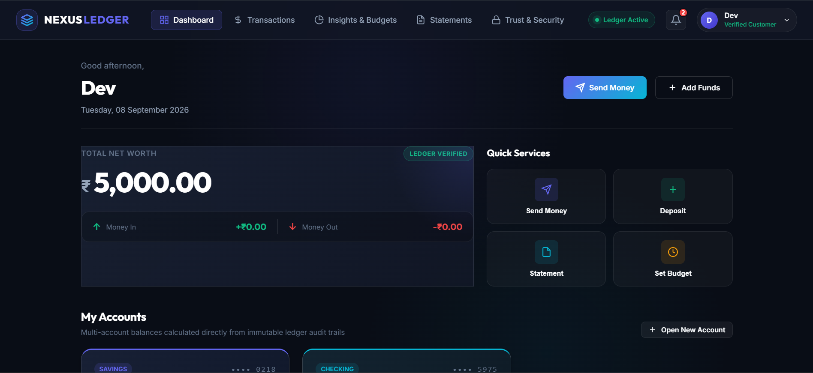
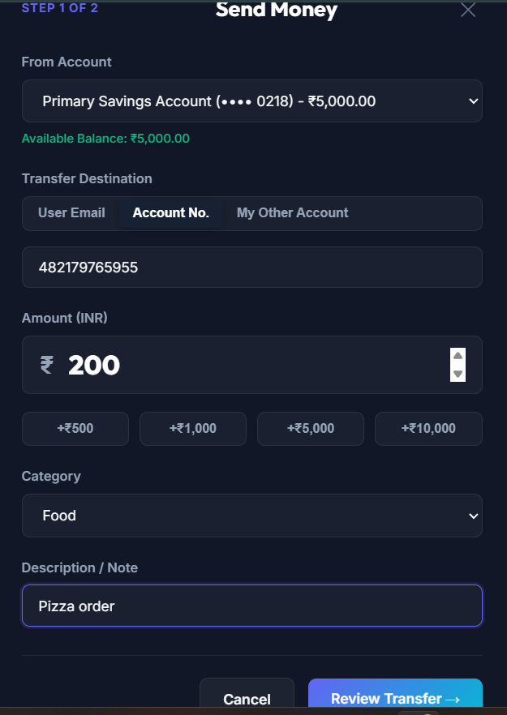
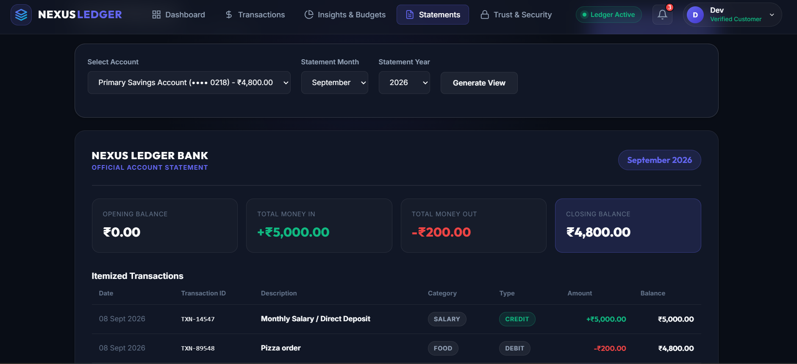

# Nexus Ledger

A full-stack personal banking and double-entry ledger platform — Node.js/Express/PostgreSQL backend with a vanilla JS/HTML/CSS frontend. Balances are never stored directly; they're always derived from an immutable ledger of debit/credit entries, with ACID-safe transfers and idempotency protection.

---

## Screenshots / Demo


# Dashboard



# Transactions

 

# Insights & Budgets  


# Statements

 

---

## Features

- **Double-entry ledger** — every transfer writes a `DEBIT` and `CREDIT` entry; balances are computed on demand via SQL aggregation instead of a mutable column.
- **ACID-safe transfers** — each transaction runs inside a Postgres transaction (`BEGIN…COMMIT/ROLLBACK`), with idempotency keys to prevent duplicate transfers on retry.
- **Authentication & sessions** — JWT-based auth, cookie sessions, multi-device session tracking, and the ability to revoke other active sessions.
- **Accounts** — create Savings/Checking accounts, view balances, and generate account statements (JSON or CSV, filterable by month/year).
- **Transactions** — transfer, deposit, and view/search transaction history with filters and pagination.
- **Budgets** — set monthly category budgets and track spend against them.
- **Insights** — monthly spending breakdown by category, month-over-month comparisons, and income vs. expense cashflow summaries.
- **Notifications** — in-app notifications with read/unread state.

---

## Tech Stack

**Backend:** Node.js, Express 5, PostgreSQL (`pg`), JWT (`jsonwebtoken`), `bcryptjs`, `cookie-parser`, `nodemailer`
**Frontend:** HTML, CSS, vanilla JavaScript (no framework)
**Database:** PostgreSQL with SQL migrations

---

## Project Structure

```
banking-ledger/
├── Backend/
│   ├── server.js                          # entry point
│   ├── package.json
│   └── src/
│       ├── app.js                         # Express app setup, middleware, route mounting
│       ├── check_db.js                    # DB connectivity check
│       ├── config/
│       │   ├── config.js                  # app/env config
│       │   └── db.js                      # PostgreSQL connection pool
│       ├── controllers/
│       │   ├── account.controller.js
│       │   ├── auth.controller.js
│       │   ├── budget.controller.js
│       │   ├── insight.controller.js
│       │   ├── notification.controller.js
│       │   └── transaction.controller.js
│       ├── db/
│       │   ├── migrate.js                 # migration runner
│       │   └── migrations/
│       │       └── 001_create_schema.sql  # users, accounts, ledger_entries, transactions, budgets, notifications, etc.
│       ├── middleware/
│       │   └── auth.middleware.js         # JWT auth + system-user auth
│       ├── models/
│       │   ├── account.model.js
│       │   ├── blackList.model.js         # revoked JWT tracking
│       │   ├── budget.model.js
│       │   ├── ledger.model.js
│       │   ├── notification.model.js
│       │   ├── transaction.model.js
│       │   └── user.model.js
│       ├── routes/
│       │   ├── account.routes.js
│       │   ├── auth.routes.js
│       │   ├── budget.routes.js
│       │   ├── insight.routes.js
│       │   ├── notification.routes.js
│       │   └── transaction.routes.js
│       └── services/
│           ├── email.service.js           # nodemailer notifications
│           └── statement.service.js       # account statement generation (JSON/CSV)
│
├── Frontend/
│   ├── index.html
│   ├── css/
│   │   └── style.css
│   └── js/
│       ├── api.js                         # API client / fetch wrappers
│       ├── app.js                         # app bootstrap, view routing
│       ├── components.js                  # UI components/render functions
│       └── state.js                       # client-side state management
│
├── docs/
│   └── images/                            # demo screenshots (add yours here)
│
├── Banking.md                             # project documentation
├── Banking.pdf                            # project documentation (PDF)
└── README.md
```

---

## How the Ledger Works

Instead of a mutable `balance` column, every account's balance is derived in real time:

Each transfer:
- Requires a client-supplied **idempotency key** to prevent duplicate transactions on network retries.
- Runs inside an isolated **Postgres transaction**, so either everything (ledger entries + transaction record) commits, or nothing does.
- Validates the source account is `ACTIVE` and has sufficient balance before moving funds.

---

## Database Schema

Defined in `Backend/src/db/migrations/001_create_schema.sql`:

| Table | Purpose |
|---|---|
| `users` | User profiles and hashed credentials |
| `user_sessions` | Active device/login tracking |
| `accounts` | Savings/Checking accounts with unique account numbers |
| `transactions` | Transfer, deposit, and withdrawal history with idempotency keys |
| `ledger_entries` | Immutable double-entry bookkeeping journal |
| `budgets` | Monthly budget limits per category |
| `notifications` | User notification history and read state |
| `token_blacklist` | Revoked JWTs |


## API Overview

All routes are prefixed with `/api`. Protected routes require a valid JWT (via cookie/auth middleware).

**Auth** — `/api/auth`
- `POST /register` · `POST /login` · `POST /logout`
- `GET /me` · `GET /sessions` · `POST /sessions/revoke-others`

**Accounts** — `/api/accounts`
- `POST /` — create account
- `GET /` — list user accounts
- `GET /balance/:accountId`
- `GET /statement/:accountId` — supports `?month=&year=&format=json|csv`

**Transactions** — `/api/transactions`
- `GET /` — search/filter/paginate
- `GET /:id` — single transaction receipt
- `POST /` — transfer funds
- `POST /deposit` — add funds
- `POST /system/initial-funds` — system-seeded funds (system-user only)

**Budgets** — `/api/budgets`
- `GET /` · `POST /` · `DELETE /:id`

**Insights** — `/api/insights`
- `GET /spending` · `GET /cashflow`

**Notifications** — `/api/notifications`
- `GET /` · `PATCH /:id/read` · `POST /read-all`

**Health check:** `GET /health`

---

